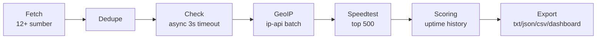

<div align="center">

# 🛡️ ProxyForge

**Proxy list gratis berkualitas — dikumpulkan, divalidasi, di-speedtest, dan diranking otomatis setiap 2 jam.**

[](https://github.com/keika-sy/ProxyForgeme/actions/workflows/update.yml)
[](https://github.com/keika-sy/ProxyForgeme)
[](#-endpoint-list)
[](https://keika-sy.github.io/ProxyForgeme/)

[🌐 Dashboard](https://keika-sy.github.io/ProxyForgeme/) · [📥 All Proxies](https://raw.githubusercontent.com/keika-sy/ProxyForgeme/main/results/all.txt) · [🏆 Top 100](https://raw.githubusercontent.com/keika-sy/ProxyForgeme/main/results/ranked/top100.txt)

</div>

---

## ✨ Fitur

| | Fitur | Keterangan |
|---|---|---|
| 🌍 | **Multi-protokol** | HTTP, SOCKS4, SOCKS5 dari 12+ sumber publik |
| ⚡ | **Validasi ketat** | Async check, timeout < 3 detik, deteksi anonymity (elite / anonymous / transparent) |
| 🗺️ | **Geo-location** | Dikelompokkan per negara, 40+ negara |
| 🚀 | **Speed test** | Latency + throughput untuk 500 kandidat tercepat |
| 📈 | **Uptime scoring** | Skor 0–100 per proxy dengan decay harian; proxy mati >7 hari dibuang otomatis |
| 📦 | **Multi-format** | TXT, JSON, CSV, ranked top 100 |
| 📱 | **Dashboard** | Statistik + grafik real-time, mobile-friendly |

## 📥 Endpoint List

Semua link bisa langsung dipakai di aplikasi / script kamu:

| Kategori | Link Raw |
|---|---|
| All Proxies | [`results/all.txt`](https://raw.githubusercontent.com/keika-sy/ProxyForgeme/main/results/all.txt) |
| HTTP Only | [`results/http.txt`](https://raw.githubusercontent.com/keika-sy/ProxyForgeme/main/results/http.txt) |
| SOCKS4 Only | [`results/socks4.txt`](https://raw.githubusercontent.com/keika-sy/ProxyForgeme/main/results/socks4.txt) |
| SOCKS5 Only | [`results/socks5.txt`](https://raw.githubusercontent.com/keika-sy/ProxyForgeme/main/results/socks5.txt) |
| Per Negara | `results/countries/{CC}.txt` — contoh: [🇮🇩 ID](https://raw.githubusercontent.com/keika-sy/ProxyForgeme/main/results/countries/ID.txt), [🇺🇸 US](https://raw.githubusercontent.com/keika-sy/ProxyForgeme/main/results/countries/US.txt) |
| Ranked Top 100 | [`results/ranked/top100.txt`](https://raw.githubusercontent.com/keika-sy/ProxyForgeme/main/results/ranked/top100.txt) |
| JSON | [`results/all.json`](https://raw.githubusercontent.com/keika-sy/ProxyForgeme/main/results/all.json) |
| CSV | [`results/all.csv`](https://raw.githubusercontent.com/keika-sy/ProxyForgeme/main/results/all.csv) |

> [!TIP]
> Format tiap baris: `ip:port`. Untuk JSON, tiap objek memuat protocol, country, anonymity, latency, speed, dan score.

<details>
<summary><b>⚙️ Cara Kerja Pipeline</b></summary>



1. **Fetch** — ambil proxy dari TheSpeedX, monosans, proxyscrape, geonode.
2. **Check** — validasi async; hanya proxy hidup yang lolos.
3. **Speedtest** — ukur latency + throughput.
4. **Score** — update riwayat uptime (`data/history.json` dipertahankan antar run).
5. **Export** — tulis semua format + dashboard + tabel README.

</details>

<details>
<summary><b>💻 Menjalankan Lokal</b></summary>

```bash
git clone https://github.com/keika-sy/ProxyForgeme.git
cd ProxyForgeme
pip install -e ".[dev]"

pytest -q                 # jalankan test
python -m proxyforge run  # pipeline penuh
```

Opsi tambahan:

```text
--timeout 3            # timeout check per proxy (detik)
--concurrency 150      # jumlah koneksi paralel
--max-speedtest 500    # jumlah kandidat speedtest
--skip-fetch           # pakai hasil fetch sebelumnya
--skip-geo             # lewati geo-location
--skip-speedtest       # lewati speed test
```

</details>

<details>
<summary><b>🌐 Setup GitHub Pages (Dashboard)</b></summary>

Settings → Pages → Source: **Deploy from a branch** → Branch: `main`, folder `/docs`.

</details>

---

<!-- PROXYFORGE:START -->
**556** proxy aktif | HTTP: **340** | SOCKS4: **53** | SOCKS5: **163**

| Kategori | Link Raw |
|---|---|
| All | `results/all.txt` |
| HTTP | `results/http.txt` |
| SOCKS4 | `results/socks4.txt` |
| SOCKS5 | `results/socks5.txt` |
| Ranked Top 100 | `results/ranked/top100.txt` |
| JSON | `results/all.json` |
| CSV | `results/all.csv` |

Top negara: CN (159), US (59), IN (22), DE (21), FR (21), NL (20), HK (20), CA (19), ID (17), SG (14)

_Diupdate otomatis oleh GitHub Actions setiap 2 jam._
<!-- PROXYFORGE:END -->
